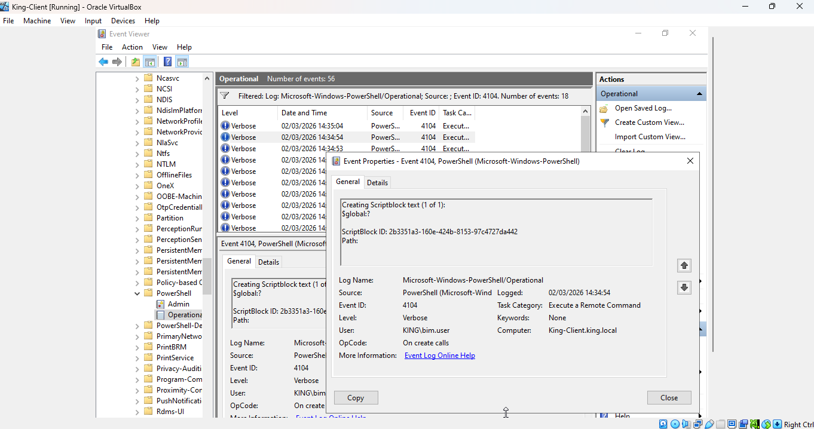
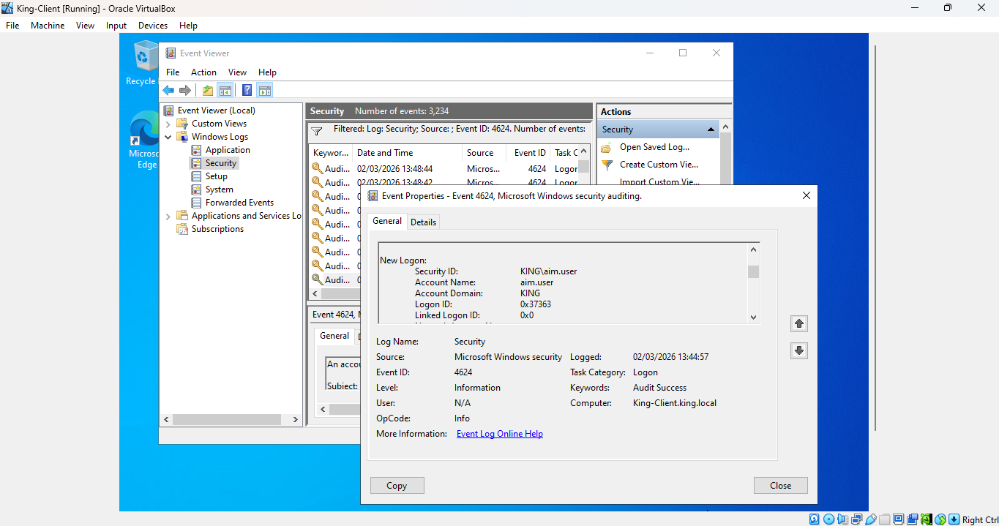
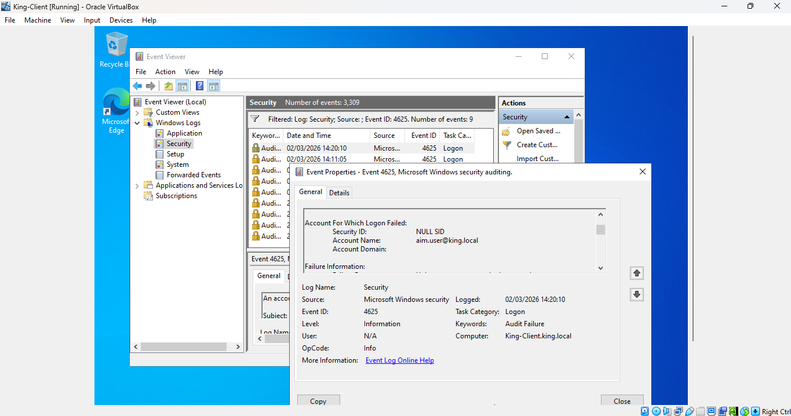
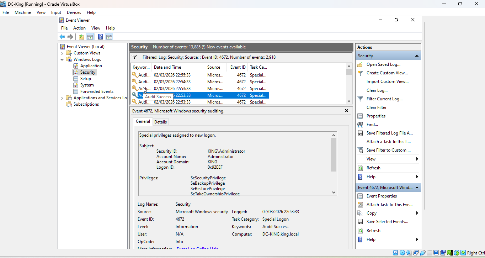
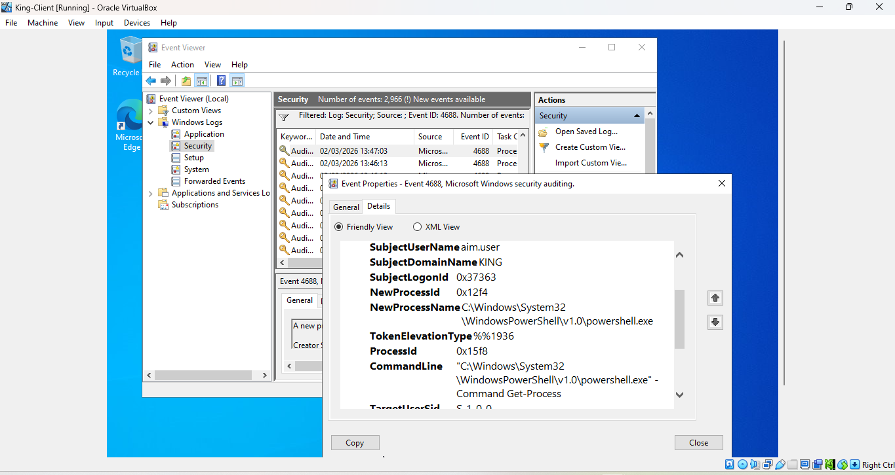
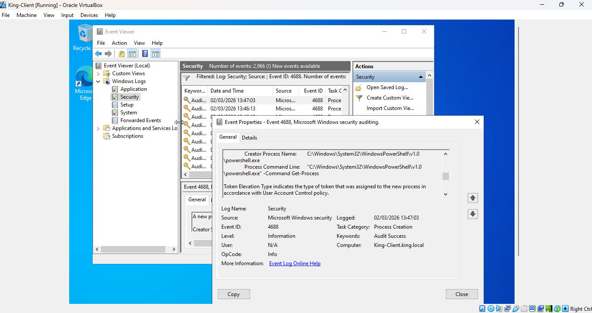
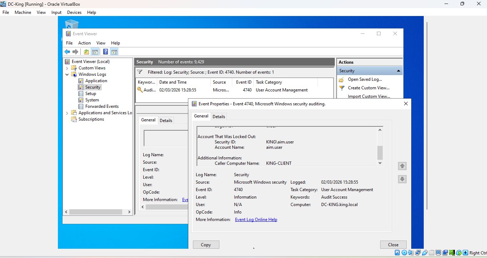
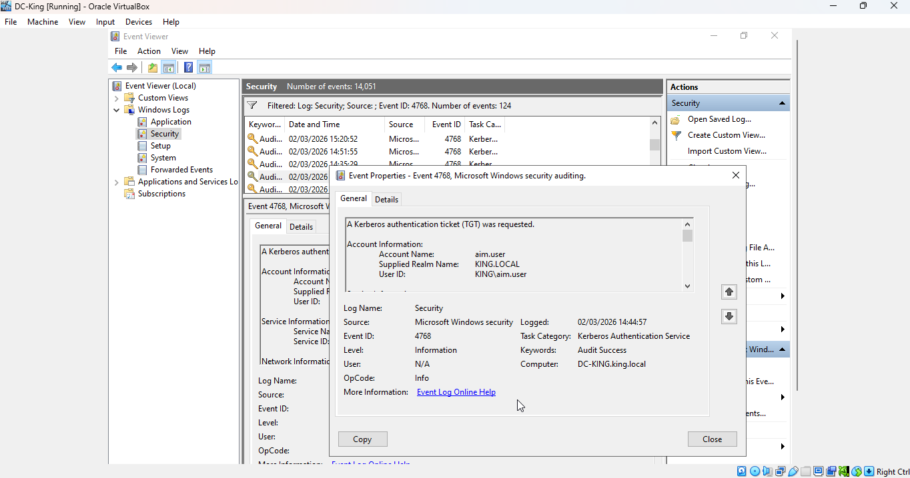
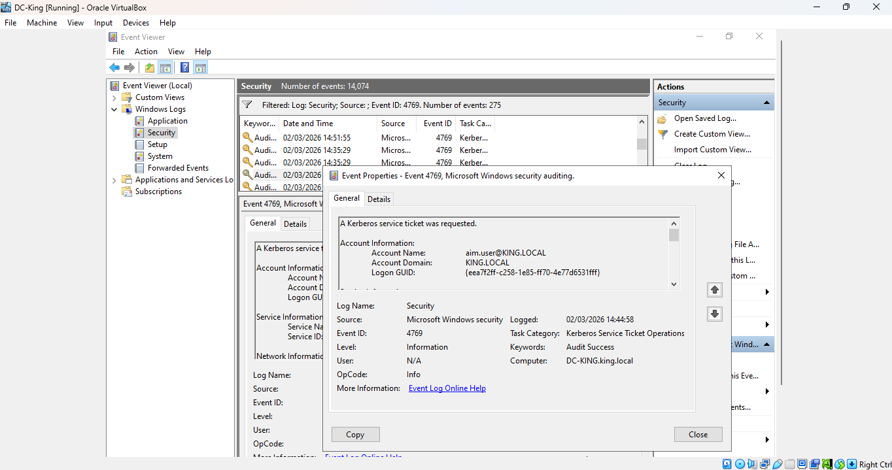

# Active Directory Security Lab
Enterprise Authentication, Access Control & Blue Team Detection | Home Lab Project

## Project Overview

This project is a production-modelled Active Directory (AD) security lab designed to simulate enterprise authentication, access control, attack activity, and Blue Team detection workflows. Built on Windows Server 2022 with a domain-joined client machine in an isolated VirtualBox environment, it validates detection coverage across 9 Windows Security event captures spanning authentication monitoring, privilege escalation, process execution, and PowerShell telemetry. The lab bridges the gap between system administration and defensive security monitoring, providing a realistic environment for SOC-ready skill development.

## Objectives

- Deploy and configure an enterprise-grade Active Directory domain with structured OU design
- Implement Role-Based Access Control (RBAC) with security group separation and least privilege enforcement
- Engineer advanced audit and Group Policy configurations for comprehensive Windows event logging
- Enable PowerShell Script Block Logging and transcription for deep endpoint telemetry
- Simulate controlled attack scenarios including brute-force, privilege escalation, and suspicious process execution
- Validate detection coverage by correlating simulated attack activity against Windows Security event logs

## Lab Architecture
king.local
                        |
          ┌─────────────────────────┐
          │   Domain Controller      │
          │   Windows Server 2022    │
          │   (King-DC)              │
          └────────────┬────────────┘
                       │
              VirtualBox Internal
                 Lab Network
                       │
          ┌────────────┴────────────┐
          │   Client Machine         │
          │   Windows 10/11          │
          │   (King-Client)          │
          └─────────────────────────┘

| Component | Detail |
|---|---|
| Domain Controller | Windows Server 2022 |
| Domain Name | king.local |
| Client Machine | Domain-joined Windows client (King-Client) |
| Network | Isolated VirtualBox internal lab network |

## Prerequisites

| Requirement | Detail |
|---|---|
| Virtualisation | VirtualBox 7.0 or later |
| DC OS | Windows Server 2022 ISO |
| Client OS | Windows 10 or Windows 11 ISO |
| RAM | Minimum 8GB (16GB recommended) |
| Storage | Minimum 80GB free disk space |
| Network | VirtualBox Internal Network (no internet required) |

## Tools & Libraries

| Tool | Purpose |
|---|---|
| VirtualBox | Virtualisation platform for hosting DC and client VMs |
| Windows Server 2022 | Domain Controller operating system |
| Active Directory Domain Services | Domain management, OU design, and user/group administration |
| Group Policy Management Console | Audit policy and PowerShell logging configuration |
| Windows Event Viewer | Security event log analysis and detection validation |
| PowerShell | Attack simulation and telemetry configuration |

## Key Findings

- Successfully deployed a structured three-OU design (King-Users, King-Admins, King-Computers) reflecting enterprise separation of duties
- RBAC implemented across three security groups: Blue-Team, Red-Team, and Purple-Team, demonstrating tiered access delegation
- Domain-level password and lockout policy enforced: 10-character minimum, complexity enabled, 5-attempt lockout threshold, 15-minute lockout duration
- Brute-force simulation confirmed detection via Event ID 4625 (Failed Logon) and Event ID 4740 (Account Locked Out)
- Successful logon and privilege assignment captured via Event ID 4624 and Event ID 4672
- Kerberos authentication flow validated via Event ID 4768 (TGT Request) and Event ID 4769 (Service Ticket Request)
- Process creation logging confirmed via two Event ID 4688 captures with full command-line visibility
- PowerShell Script Block Logging confirmed via Event ID 4104, providing visibility into script execution activity
- Audit subcategory override enforcement enabled granular activity capture beyond Windows default logging

## Event ID Reference

| Event ID | Category | Description | Attack Detected |
|---|---|---|---|
| 4104 | PowerShell | Script Block Logging | Obfuscated or suspicious script execution |
| 4624 | Authentication | Successful Logon | Baseline and anomalous logon activity |
| 4625 | Authentication | Failed Logon | Brute-force and password spray attempts |
| 4672 | Privilege | Special Privileges Assigned | Privilege escalation activity |
| 4688 | Process | Process Creation | Suspicious process and command-line execution |
| 4740 | Account | Account Locked Out | Brute-force threshold breach |
| 4768 | Kerberos | TGT Request | Kerberos reconnaissance and abuse |
| 4769 | Kerberos | Service Ticket Request | Kerberoasting and lateral movement indicators |

## Analyses

| Analysis | Description |
|---|---|
| 1. OU Architecture | Three-tier OU design reflecting enterprise separation of duties |
| 2. RBAC Configuration | Security group creation and user privilege delegation |
| 3. Password & Lockout Policy | Domain-level enforcement and brute-force detection validation |
| 4. Authentication Monitoring | Event ID capture for logon, Kerberos, and privilege activity |
| 5. Process & PowerShell Telemetry | Command-line auditing and Script Block Logging configuration |
| 6. Attack Simulation | Controlled brute-force, privilege escalation, and process execution scenarios |
| 7. Detection Validation | Correlation of simulated attack activity against Windows Security event logs |

## How to Run

1. Clone the repository:

```bash
git clone https://github.com/Kingsley-Eboh/Enterprise-Active-Directory-Security-Lab.git
```

2. Navigate to the project folder:

```bash
cd Enterprise-Active-Directory-Security-Lab
```

3. In VirtualBox, create two VMs: one for the Domain Controller (Windows Server 2022) and one for the client (Windows 10/11). Set both network adapters to the same VirtualBox Internal Network

4. Install Active Directory Domain Services on the DC and promote it to a domain controller using the domain name `king.local`

5. Create the OU structure (King-Users, King-Admins, King-Computers), security groups (Blue-Team, Red-Team, Purple-Team), and user accounts via Active Directory Users and Computers

6. Apply the advanced audit policy GPO and enable PowerShell Script Block Logging via Group Policy Management Console

7. Join King-Client to the `king.local` domain, then run attack simulations from the client VM

8. Open Event Viewer on the Domain Controller and validate detections against the Event IDs documented above

## Project Structure

```
Enterprise-Active-Directory-Security-Lab/
├── 4104.png                           # PowerShell Script Block Logging (Event ID 4104)
├── 4624.png                           # Successful Logon (Event ID 4624)
├── 4625.png                           # Failed Logon (Event ID 4625)
├── 4672.png                           # Special Privileges Assigned (Event ID 4672)
├── 4688.png                           # Process Creation (Event ID 4688)
├── 4688a.png                          # Process Creation - second scenario (Event ID 4688)
├── 4740.png                           # Account Locked Out (Event ID 4740)
├── 4768.png                           # Kerberos TGT Request (Event ID 4768)
├── 4769.png                           # Kerberos Service Ticket Request (Event ID 4769)
└── README.md                          # Project documentation
```

## Evidence

### Event ID 4104 — PowerShell Script Block Logging
[](4104.png)

### Event ID 4624 — Successful Logon
[](4624.png)

### Event ID 4625 — Failed Logon
[](4625.png)

### Event ID 4672 — Special Privileges Assigned
[](4672.png)

### Event ID 4688 — Process Creation
[](4688.png)

### Event ID 4688 — Process Creation (Second Scenario)
[](4688a.png)

### Event ID 4740 — Account Locked Out
[](4740.png)

### Event ID 4768 — Kerberos TGT Request
[](4768.png)

### Event ID 4769 — Kerberos Service Ticket Request
[](4769.png)

## Author

Kingsley Eboh  
[GitHub](https://github.com/Kingsley-Eboh)

This project is intended for portfolio and educational purposes. All attack simulations were performed in an isolated lab environment with no connection to production systems.
